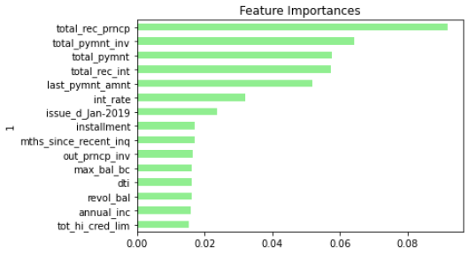

# classification_homework_uw_fintech

## Part I: Credit Risk Resampling Techniques
---
### Logistic Regression Model (Naive Random Oversampling)
---
*Balanced Accuracy Score:* 0.8325468421491353

*Confusion Matrix:*
|          | Predicted 0 | Predicted 1 |
|:--------:|:-----------:|:-----------:|
| Actual 0 |      83     |      18     |
| Actual 1 |     2680    |    14424    |

*Imbalanced: Classification Report:*
|             | pre  | rec  |  spe | f1   | geo  | iba  | sup   |
|-------------|------|------|:----:|------|------|------|-------|
| high_risk   | 0.03 | 0.82 | 0.84 | 0.06 | 0.83 | 0.69 | 101   |
| low_risk    | 1.00 | 0.84 | 0.82 | 0.91 | 0.83 | 0.69 | 17104 |
| avg / total | 0.99 | 0.84 | 0.82 | 0.91 | 0.83 | 0.69 | 17205 |

---
### Logistic Regression Model (SMOTE Oversampling)
---
*Balanced Accuracy Score:* 0.8388510243681058

*Confusion Matrix:*
|          | Predicted 0 | Predicted 1 |
|:--------:|:-----------:|:-----------:|
| Actual 0 |      82     |      19     |
| Actual 1 |     2295    |    14809    |

*Imbalanced: Classification Report:*
|             | pre  | rec  | spe  |  f1  | geo  | iba  | sup   |
|-------------|------|------|------|:----:|------|------|-------|
| high_risk   | 0.03 | 0.81 | 0.87 | 0.07 | 0.84 | 0.70 | 101   |
| low_risk    | 1.00 | 0.87 | 0.81 | 0.93 | 0.84 | 0.71 | 17104 |
| avg / total | 0.99 | 0.87 | 0.81 | 0.92 | 0.84 | 0.71 | 172   |

---
### Logistic Regression Model (Undersampling - Cluster Centroids)
---
*Balanced Accuracy Score:* 0.8215575767118339

*Confusion Matrix:*
|          | Predicted 0 | Predicted 1 |
|:--------:|:-----------:|:-----------:|
| Actual 0 |      89     |      12     |
| Actual 1 |     4072    |    13032    |

*Imbalanced: Classification Report:*
|             | pre  | rec  | spe  |  f1  | geo  | iba  | sup   |
|-------------|------|------|------|:----:|------|------|-------|
| high_risk   | 0.02 | 0.88 | 0.76 | 0.04 | 0.82 | 0.68 | 101   |
| low_risk    | 1.00 | 0.76 | 0.88 | 0.86 | 0.82 | 0.66 | 17104 |
| avg / total | 0.99 | 0.76 | 0.88 | 0.86 | 0.82 | 0.66 | 17205 |

---
### Logistic Regression Model (Combo Over/Under - SMOTEENN)
---
*Balanced Accuracy Score:* 0.8388319216626994

*Confusion Matrix:*
|          | Predicted 0 | Predicted 1 |
|:--------:|:-----------:|:-----------:|
| Actual 0 |      83     |      18     |
| Actual 1 |     2465    |    14639    |

*Imbalanced: Classification Report:*
|             | pre  | rec  | spe  |  f1  | geo  | iba  | sup   |
|-------------|------|------|------|:----:|------|------|-------|
| high_risk   | 0.03 | 0.82 | 0.86 | 0.06 | 0.84 | 0.70 | 101   |
| low_risk    | 1.00 | 0.86 | 0.82 | 0.92 | 0.84 | 0.71 | 17104 |
| avg / total | 0.99 | 0.86 | 0.82 | 0.92 | 0.84 | 0.71 | 17205 |

### *Which model had the best balanced accuracy score?*
---
When scaling the training and test sets, the SMOTE over sampling technique performed with the best balanced accuracy score, barely beating out combo over/under SMOTEENN with a score of 0.8388510243681058 vs. 0.8388319216626994.
### *Which model had the best recall score?*
---
SMOTE again bested SMOTEEN with a total recall score of 0.87 vs. 0.86
### *Which model had the best geometric mean score?*
---
SMOTE has the best geometric mean score with a 0.84 vs. 0.84 by the SMOTEENN model

## Part II: Credit Risk Esemble Techniques
---
### Balanced Random Forest Classifier
---
*Balanced Accuracy Score:* 0.7855345052746622

*Confusion Matrix:*
|          | Predicted 0 | Predicted 1 |
|:--------:|:-----------:|:-----------:|
| Actual 0 |      68     |      33     |
| Actual 1 |     1748    |    15356    |

*Imbalanced: Classification Report:*
|             | pre  | rec  | spe  |  f1  | geo  | iba  | sup   |
|-------------|------|------|------|:----:|------|------|-------|
| high_risk   | 0.04 | 0.67 | 0.90 | 0.07 | 0.78 | 0.59 | 101   |
| low_risk    | 1.00 | 0.90 | 0.67 | 0.95 | 0.78 | 0.62 | 17104 |
| avg / total | 0.99 | 0.90 | 0.67 | 0.94 | 0.78 | 0.62 | 17205 |

*Top 15 Most Important Features*

   
---
### Logistic Regression Model (SMOTE Oversampling)
---
*Balanced Accuracy Score:* 0.931601605553446

*Confusion Matrix:*
|          | Predicted 0 | Predicted 1 |
|:--------:|:-----------:|:-----------:|
| Actual 0 |      93     |      8      |
| Actual 1 |     985     |    16119    |

*Imbalanced: Classification Report:*
|             | pre  | rec  | spe  |  f1  | geo  | iba  | sup   |
|-------------|------|------|------|:----:|------|------|-------|
| high_risk   | 0.09 | 0.92 | 0.94 | 0.16 | 0.93 | 0.87 | 101   |
| low_risk    | 1.00 | 0.94 | 0.92 | 0.97 | 0.93 | 0.87 | 17104 |
| avg / total | 0.99 | 0.94 | 0.92 | 0.97 | 0.93 | 0.87 | 17205 |

### *Which model had the best balanced accuracy score?*
---
Overall, the EasyEsembleClassifer, a bag of booster learners, had a balanced accuracy score of 0.931601605553446, besting the SMOTE logistic regression of 0.8388510243681058. RandomForest could still be viable, needs more testing on parameters.
### *Which model had the best recall score?*
---
EasyEsembleClassifer again bested SMOTE logistic regression with a total recall score of 0.94 vs. 0.87

### *Which model had the best geometric mean score?*
---
EasyEsembleClassifer has the best geometric mean score with a 0.93 vs. 0.84 by the SMOTE logistic regression.

### *What are the top three features?*
---
EasyEsembleClassifier does not have a feature_importances_ function, but the top 3 features for the BalancedRandomForestClassifier were *total_rec_perncp*, *total_pymnt_inv*, *total_pyment*. These features makes sense as they indicate whether a client pays their loan and what amount determines their level of risk.